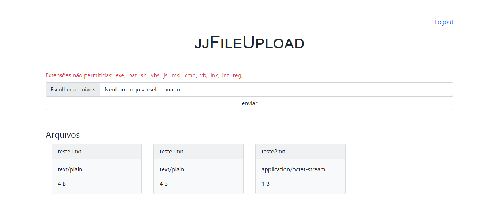

<div align="center">
    
    <p>jjFileUpload</p>
</div>

_obs.: criar .env_
```
DB_NAME=
DB_USER=
DB_PASSWORD=
DB_ROOT_PASSWORD=
```

Para a execução do projeto:
```
$ docker-compose --env-file .env up
$ php -S localhost:8080
```